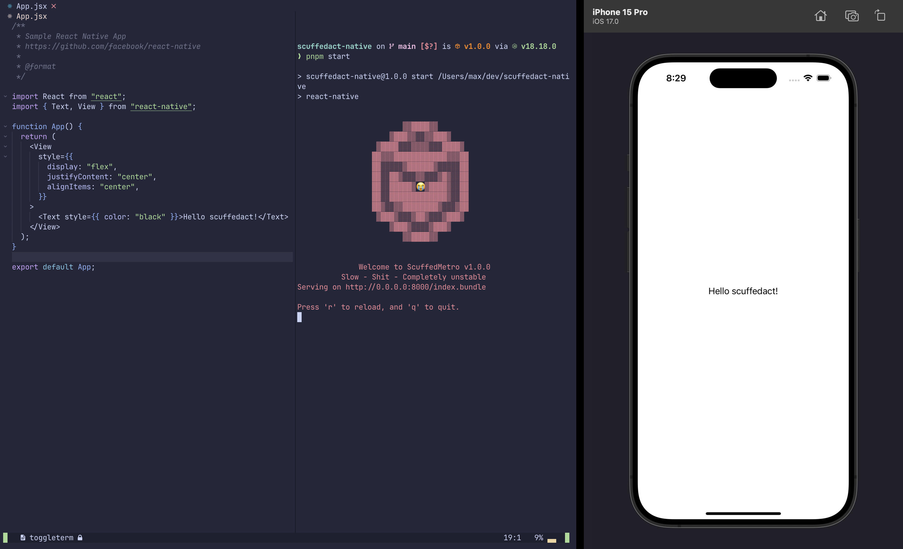

# ScuffedAct Native 🤮

_It's like React-Native but really, really scuffed!_



## Why? / Disclaimer

This is a project I threw together to learn more about the internals of React-Native,
**please don't expect anything remotely polished** (hence the name).
It's pretty much just a barebones proof-of-concept of how to run React on a native OS.

If you are curious feel free to browse the (cursed) source code. I might write
a blog post on it at some point, in which case I'll link that here.

## To Do

- Flexbox with Yoga
- Hot reload with websockets
- Android _mayyyybeee, but probably not_

## How it was built

I started with a plain react-native project and then uninstalled the core react-native package and some supporting packages.
From there I worked backwards from `AppRegistry.registerComponent()`, and implemented a system to load the JS bundle from
the native app's assets and run it in JavaScript Core. The project also includes some bindings for setting up side effects
(like JS timers) which are needed to run React.

To support `<Text>` components and render content to the screen, I used [react-reconciler](https://www.npmjs.com/package/react-reconciler)
to write a React Host Config. This implements the essential imperative function calls that React usually makes to `react-dom`,
and instead assigns them to native functions that are bound through the JSCore API.

This means that when a React element with a type of `Text` comes through, the native function is called and understands that it should
draw a native Text UIView to the screen.

## Usage

```bash
pnpm install
```

```bash
pnpm run start
```

This will start the ~~esbuild~~ ScuffedMetro™ dev server.

The JavaScript bundle is served to `localhost:8000/index.bundle` and made available inside of `dist/`. When you build and run the Xcode ios project, it should read the bundle from here.

If it can't, uhh it will probably crash? idk tbh

## Features

- Runs on (only) ios!
- Lukewarm-reloading! (The JS will build on changes, but you gotta rebuild the native app)
- Supports `<Text />`!

## Running Tests

To run tests, run the following command

```bash
pnpm run test
```
